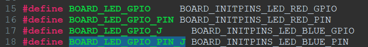

# Unidad 3
## Documentación del Proyecto
 
Nombre del estudiante: Jose Carlos Herrera Castro
ID: 000269913

# Ejercicio 1:
1. 
- C
- C++
- Assembly
- Python
- Rust
- Ada
- Java
- Lua
- Embedded JavaScript (Espruino)
- Verilog/VHDL (para sistemas embebidos en FPGA)

2. 
- **C++**: Ofrece más características que C, pero con un posible costo de rendimiento.
- **Assembly**: Aún más cercano al hardware que C, pero con una curva de aprendizaje mucho mayor.
- **Python**: Comparado con C, Python es mucho más lento y menos eficiente en sistemas con recursos limitados. No es una opción común en sistemas embebidos de bajo nivel.
- **Rust**: Más seguro que C en cuanto al manejo de memoria, pero su ecosistema en sistemas embebidos aún está en crecimiento.
- **Ada**: Aunque es más seguro que C para aplicaciones críticas, tiene menos uso y soporte en la industria general de sistemas embebidos.
- **Java**: Java es mucho más pesado y consume más recursos que C, lo que lo hace ineficiente para sistemas embebidos con limitaciones estrictas.
- **Lua**: Comparado con C, Lua es más adecuado para sistemas donde se necesite scripting ligero, pero no para control directo del hardware.
- **Verilog/VHDL**: Estos lenguajes son específicos para diseñar circuitos electrónicos, no para controlar software embebido como C.

3. Sí, existen algunos rankings y análisis de popularidad de lenguajes en el ámbito de sistemas embebidos. Uno de los más reconocidos es el "2023 Embedded Markets Study", que se publica anualmente y clasifica lenguajes basados en su uso y adopción en la industria de sistemas embebidos.
En estos estudios, C sigue siendo el líder indiscutible, seguido de C++. Assembly también mantiene una posición importante debido a su cercanía con el hardware. Python y Rust están emergiendo, especialmente Python para prototipos rápidos y Rust por su enfoque en la seguridad de la memoria. Ada sigue siendo relevante en aplicaciones críticas, como la industria aeroespacial, pero tiene una adopción limitada en otros campos.
- **----> Link**: https://www.geeksforgeeks.org/embedded-systems-programming-languages/

# Ejercicio 2:
~~~
1. 

2. 
#define SET_BIT(reg, bit) ((reg) |= (1 << (bit)))
#define CLEAR_BIT(reg, bit) ((reg) &= ~(1 << (bit)))
#define TOGGLE_BIT(reg,bit) ((reg)) ^=  (1 << 31)
3.  
#define CHECK_PER(reg) (reg >> 31)
~~~

# Ejercicio 3:
~~~
//Correcion del codigo
#include <stdio.h>
#include <string.h>

int main() {
    // Datos enteros
    float entero = 10.5;  
    printf("El valor del entero es: %d\n", entero);  

    // Datos float
    float decimal = 3.0 / 2.0;  // O tambien float decimal = (float)3 / 2;
    printf("El valor del decimal es: %f\n", decimal);  
    float decimal_1 = 12.5 * 5;  
    printf("El valor del decimal es: %f\n", decimal_1);  

    // Caracteres
    char letra = `A`;  
    printf("El valor del caracter es: %c\n", letra);

    // Cadenas de caracteres
    char nombre[6];  
    strcpy(nombre, "Henry");  
    printf("El nombre es: %s\n", nombre);

    return 0;
}
~~~

# Ejercicio 4:
~~~
#include <stdio.h>

int main() {
    int i;
    int num = 10;
    int array[5] = {1, 2, 3, 4, 5};
    int contador = 0;

    for (i = 1; i < 10; i++) {
        printf("Valor de i: %d\n", i);
    }

    for (i = 0; i <= 4; i++) { // O tambien for (i=0; i<5; i++)
        printf("Elemento del array: %d\n", array[i]);
    }

    while (num != 0) {
        printf("Valor de num: %d\n", num);
        num = num - 1;  
    }

    while (contador < 5) { // El contador nunca se actualiza entonces no va a cambiar
        printf("Valor de contador: %d\n", contador);
    }

    return 0;
}
~~~
## Reto:
Configuré un nuevo pin para un nuevo led en el micro.
- **Aqui declare el gpio y el pin**

- **Aqui configure el delay del led**

- **Aqui el numero del pin 10 , el regisgtro y el gpio los cuales van ser del registro E**

- **Por ultimo aqui inicialice todo**

## Evaluacion:
# Maquina de estados

- **XX**: Esta es la variable que digita la persona que va desde 00 hasta 99 
- **YY**: Esta es la variable es la que queda guardada anteriormente 
- **A**: Activa el PWM y pasar al estado donde el LED varía su intensidad según el ciclo útil actual.
- **B**: Desactiva el PWM y apagar el LED, regresando al estado inicial.
- **C**: Cancela el proceso de cambio al presionar en cualquier momento (Cualquier estado) y ademas el sistema debe descartar el cambio y regresar al estado anterior.
- **D**: Confrima el cambio. El sistema debe actualizar el ciclo útil del PWM al nuevo valor ingresado.

El estado inicial espera de una entrada del usuario despues de haber presionado la tecla A principalmente, el estado de PWM activado el led varia su intensidad dependiendo
del valor ingredsado el usuario "XX" ademas de que tambien en este estado se puede con la tecla "B" desactivar el PWM y apagar el led , cancelar el cambio de la variable "YY"guardada 
y por ultimo presionar la tecla "D"  para confirmar el cambio y pasar a la configuracion del ciclo util  con el nuevo valor.

# Implentacion del ejempo de SDK de PWM:

- **Led con alta intencidad**

- **Led con baja intencidad**

# Pines:
Se utilizara el registro E para facilitar y utilizar como base el programa de Led_blinky

**Pines de entrada: (Columnas)**
- PTE10
- PTE11
- PTE12
- PTE14
**Pines de salidas: (Filas)**
- PTE15
- PTE16
- PTE2
- PTE6

