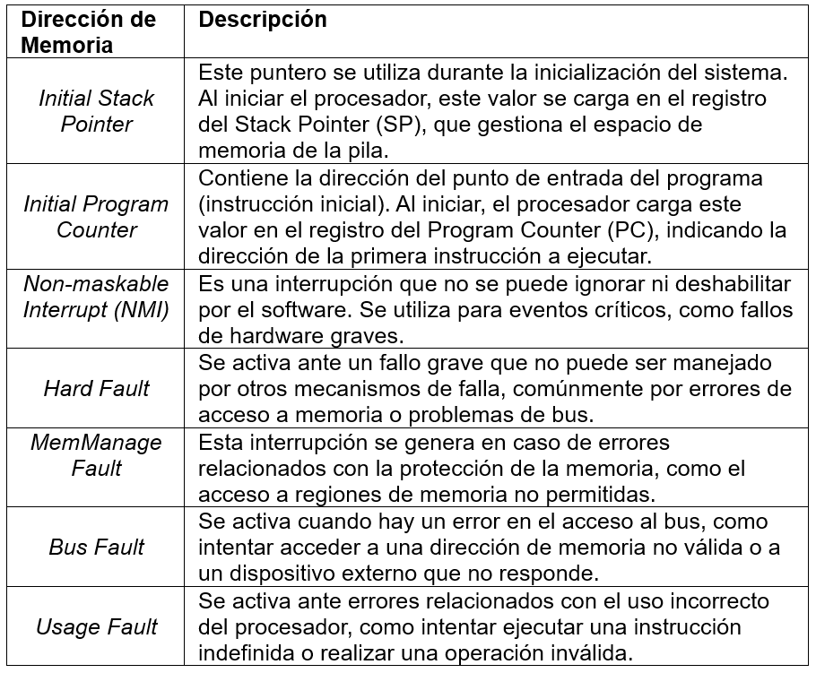

#   Resumen Módulo de Interrupciones NVIC
## Introducción
Las interrupciones son eventos que ocurren durante la ejecución de un programa, interrumpiendo su flujo normal para atender una tarea prioritaria. Estas interrupciones pueden ser generadas por hardware (eventos externos como cambios en las entradas) o por software (instrucciones del programa). Las interrupciones se clasifican en enmascarables (controlables mediante habilitación/deshabilitación) y no enmascarables (NMI), las cuales siempre deben ser atendidas.

## Modos de operación del procesador
El procesador ARM Cortex-M4 opera en dos modos:

1. **Thread Mode**: Ejecuta el código principal. Mientras lo hace, puede ser interrumpido para atender eventos externos.
2. **Handler Mode**: Ejecuta el código en respuesta a una interrupción. Durante este modo, las interrupciones normales están deshabilitadas para evitar que el manejo de la interrupción actual sea interrumpido.

## Estados de excepción
Los microcontroladores manejan interrupciones y excepciones en diferentes estados:

1. **Inactivo**: No hay excepciones.
2. **Pendiente**: Se ha detectado una excepción, pero aún no ha sido atendida.
3. **Activo**: El procesador está manejando una excepción.
4. **Activo y Pendiente**: Múltiples excepciones del mismo tipo están ocurriendo simultáneamente.

## Tratamiento de una interrupción
Cuando se atiende una interrupción, el procesador realiza varios pasos:

1. Guarda el estado actual del programa (registros y estado de la pila).
2. Cambia al Handler Mode para ejecutar la rutina de interrupción (ISR).
3. Al terminar, restaura el estado anterior y vuelve al User Mode.

## Contexto de interrupción (Context Saving):
Cuando un microcontrolador atiende una interrupción, es fundamental que pueda guardar y restaurar el contexto del programa que se estaba ejecutando antes de la interrupción. Este contexto incluye:

- Registros del procesador
- Estado de la pila
- Dirección de retorno

Esto es necesario porque el microcontrolador debe cambiar su flujo de ejecución temporalmente para manejar la interrupción y luego regresar al estado anterior para continuar con el programa.

**Pasos para gestionar la interrupción**

1. **Guardar el Estado Actual del Proceso:**

- Antes de ejecutar la rutina de interrupción, se guarda el estado actual del proceso en la pila. Esto incluye:
- Contador de programa (PC)
- Registros de propósito general
- Registro de estado (PSR)
- Si se utiliza un módulo de punto flotante, se guardan más registros como contexto.

2. **Cambiar al Modo de Manejador (Handler Mode):**
El microcontrolador cambia al modo de manejo de interrupciones para ejecutar la rutina de interrupción, permitiendo el uso de instrucciones privilegiadas y acceso a recursos críticos.

3. **Ejecutar la Rutina de Interrupción:**
Se lleva a cabo la ejecución de la rutina de interrupción para gestionar la causa de la interrupción.

4. **Restaurar el Estado Anterior del Proceso:**
Tras completar la rutina de interrupción, se restaura el estado previo desde la pila, recuperando los registros del procesador y la dirección de retorno.

5. **Volver al Modo de Usuario (User Mode):**
Finalmente, el microcontrolador regresa al modo de usuario y continúa la ejecución del programa principal desde el punto donde se interrumpió.

## Módulo NVIC
El Nested Vectored Interrupt Controller (NVIC) es el encargado de gestionar las interrupciones en los microcontroladores ARM Cortex-M4. Configura prioridades, habilita/deshabilita interrupciones, y maneja el vector de interrupción para ejecutar la rutina correspondiente.

## Mapa de interrupciones
El mapa de interrupciones es una estructura fundamental en la memoria de un microcontrolador, que se encuentra en las primeras posiciones de la memoria. Cada posición de este mapa contiene un apuntador a la dirección de memoria específica donde se ubica el Interrupt Handler correspondiente.

**Estructura del Mapa de Interrupciones**
En la parte superior del mapa, se encuentran las primeras interrupciones específicas de ARM, generadas por la CPU. La siguiente tabla describe las direcciones de memoria asignadas y las fuentes de estos primeros vectores:

## Interrupt Request o IRQ: 
Un IRQ es una señal enviada al procesador para indicarle que se necesita su atención para manejar un evento especial, como la finalización de una operación de entrada/salida (E/S) o un error de hardware. El procesador pausa su tarea actual para manejar la interrupción.

## Gestión de interrupciones (Interrupt Handling):

- **Registro para interrupciones**: Un procesador tiene registros especiales que gestionan las interrupciones. Estos registros guardan la dirección de memoria del manejador de interrupciones (ISR, Interrupt Service Routine), el cual se ejecuta cuando ocurre una interrupción.

- **Tabla de vectores de interrupción (Interrupt Vector Table)**: Es una tabla en memoria que contiene las direcciones de los manejadores de interrupciones. Cuando ocurre una interrupción, el procesador consulta esta tabla para localizar y ejecutar el ISR adecuado.

**Número de IRQ y registros NVIC**
El número de IRQ es un identificador único para cada interrupción. Para gestionarlas, el NVIC utiliza registros como:

- **ISER (Set Enable)**: Para habilitar una interrupción.
- **ICER (Clear Enable)**: Para deshabilitarla.
- **ISPR (Set Pending)**: Para marcarla como pendiente.
- **ICPR (Clear Pending)**: Para borrar el estado pendiente.
- **IABR (Active Bit)**: Indica si una interrupción está activa.
- **IPR (Priority)**: Establece la prioridad de la interrupción.

## Niveles de prioridad
En los ARM Cortex-M4, las interrupciones tienen niveles de prioridad, donde 0 es el nivel más alto y 15 el más bajo. El NVIC permite gestionar la ejecución de interrupciones en función de su prioridad.

**Ejemplos de código**
Para habilitar la interrupción del temporizador SysTick, se establece su prioridad y se configura en el NVIC. Las funciones básicas para manipular interrupciones incluyen:

- **Habilitar**: NVIC_EnableIRQ(IRQn);
- **Deshabilitar**: NVIC_DisableIRQ(IRQn);
- **Marcar como pendiente**: NVIC_SetPendingIRQ(IRQn);
- **Limpiar el estado pendiente**: NVIC_ClearPendingIRQ(IRQn);
- **Establecer prioridad**: NVIC_SetPriority(IRQn, aqui va la prioridad);

## Rutinas de servicio de interrupción (ISR)

**Ejemplo de ISRs:**
~~~
__attribute__((interrupt)) void SysTick_Handler(void) {
	contador_systick++;
}

__attribute__((interrupt)) void PORTC_IRQHandler(void) {
	if ((PORTC->ISFR & MASK_PULSADOR) != 0) {
		PORTC->ISFR = (MASK_PULSADOR);  // limpiar la bandera
	}
}
~~~

**Ejemplo práctico**
Para atender un pulsador, se configura el pin GPIO como entrada y se habilita una interrupción en el flanco de subida o bajada. Cuando el pulsador cambia de estado, se genera una interrupción, y el microcontrolador ejecuta la rutina asociada para manejar la acción.

Este manejo eficiente de interrupciones permite al microcontrolador responder a eventos externos sin afectar el rendimiento del programa principal.

## Eventos que producen una interrupción:

- **Eventos de hardware**: Incluyen señales desde periféricos como teclados, ratones, o controladores de disco. Estos envían una señal IRQ al procesador cuando ocurre un evento relevante.
- **Interrupciones de software**: Son generadas por el propio código, ya sea explícitamente a través de instrucciones o como resultado de errores o excepciones en la ejecución.
